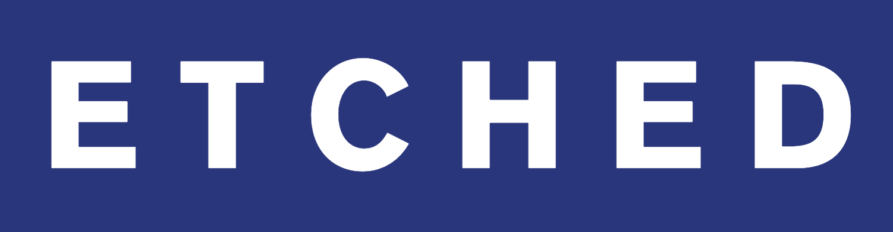
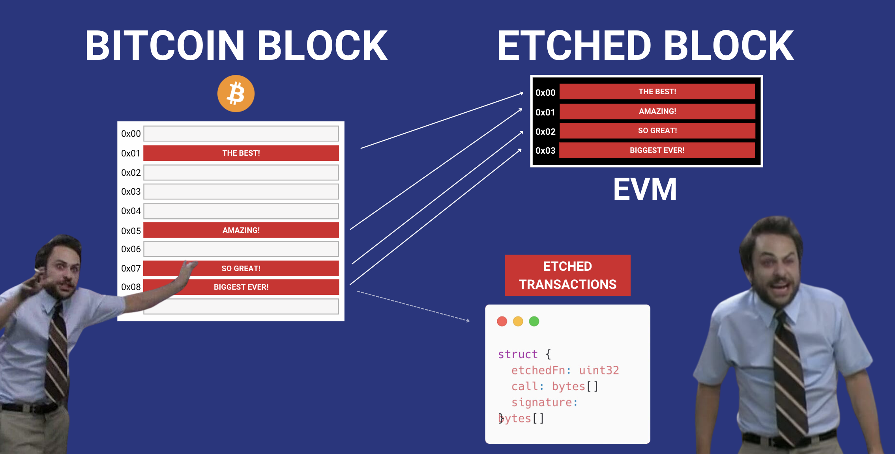

# What is Etched?

Etched is a FOSS Bitcoin Layer 2 project. It allows users to deploy and interact with Ethereum Virtual Machine (EVM) smart contracts by processing transactions directly on the Bitcoin blockchain. 

Etched is NOT a rollup, Etched is a EVM layer 2. Etched uses Bitcoin's POW for security, sequencing and data. Etched is trustless with no centralised part. 

## Docs
TBD

## Contributing
Contributors welcomed. Etched is a FOSS project and aims to be credible neutral. 

## Community
TBD

License
The Etched node repository is licensed under the MIT License. For more details, see the LICENSE file in the repository.